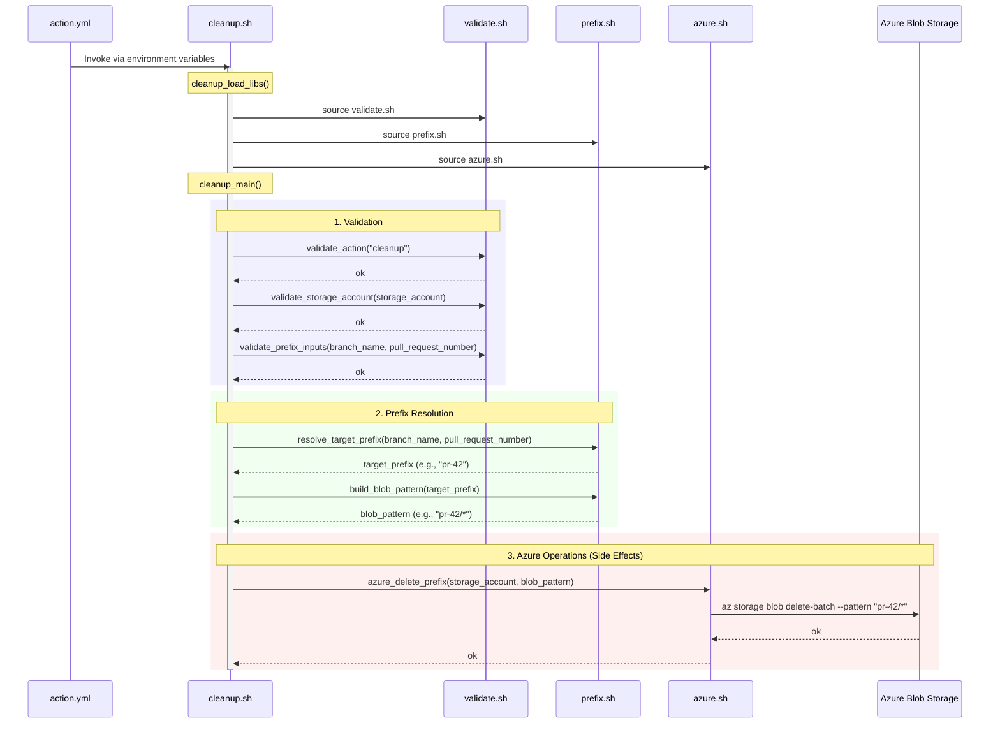
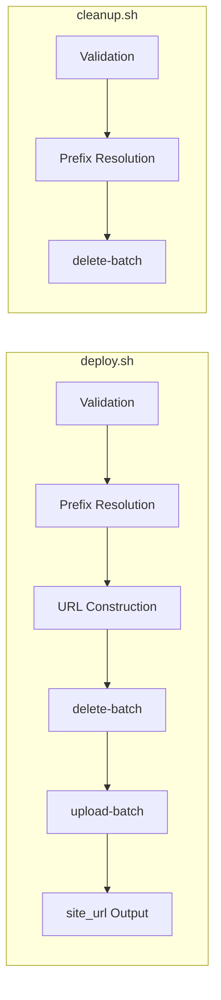

> [日本語版](cleanup.ja.md)

# cleanup.sh Design

## Overview

`scripts/cleanup.sh` is the entrypoint script invoked from `action.yml` when `action=cleanup`. It deletes all blobs under the target prefix. Primarily used to remove the staging environment when a PR is closed.

## Inputs

Received via environment variables or function arguments. Environment variables are mapped from `inputs` by `action.yml`.

| Priority | Function Arg | Environment Variable | Description |
|----------|-------------|---------------------|-------------|
| 1 | `$1` | `INPUT_STORAGE_ACCOUNT` | Azure Storage account name |
| 2 | `$2` | `INPUT_BRANCH_NAME` | Branch name |
| 3 | `$3` | `INPUT_PULL_REQUEST_NUMBER` | PR number |
| 4 | `$4` | `INPUT_ACTION` | Action type (default: `cleanup`) |

## Outputs

- stdout: None (unlike `deploy.sh`, does not return `site_url`)

## Processing Flow

### Sequence Diagram



### Comparison with deploy.sh



`cleanup.sh` is a subset of `deploy.sh`, with the following parts unnecessary:

- `source_dir` validation (no upload target)
- URL construction (does not return an output URL)
- `azure_upload_dir` (no upload)

### Processing Steps in Detail

#### 1. Validation (validate.sh)

Uses the same validation functions as `deploy.sh`, but does not call `validate_source_dir` (since `source_dir` is not needed).

| Function | Validation |
|----------|-----------|
| `validate_action` | Must be `deploy` or `cleanup` |
| `validate_storage_account` | Must be 3-24 lowercase alphanumeric characters |
| `validate_prefix_inputs` | Either `branch_name` or `pull_request_number` must be valid |

#### 2. Prefix Resolution (prefix.sh)

Determines `target_prefix` using the same logic as `deploy.sh`. URL construction is not performed.

- `resolve_target_prefix`: Generates `pr-<number>` with priority on `pull_request_number`
- `build_blob_pattern`: Generates the glob pattern for deletion targets (e.g., `pr-42/*`)

#### 3. Azure Operations (azure.sh)

Only `azure_delete_prefix` is executed.

- Deletes all blobs matching the target pattern in the `$web` container using `az storage blob delete-batch`
- Uses OIDC authentication via `--auth-mode login`

## Error Handling

Same error handling approach as `deploy.sh`.

- Each step propagates errors to the caller via `|| return 1`
- When the script is executed directly, `set -euo pipefail` causes immediate exit on undefined variable references or pipe errors
- Validation errors are detected before Azure operations

## Typical Usage Scenario

```yaml
# Remove the staging environment when a PR is closed
cleanup:
  if: github.event_name == 'pull_request' && github.event.action == 'closed'
  steps:
    - uses: nuitsjp/azure-blob-storage-site-deploy@v1
      with:
        action: cleanup
        storage_account: ${{ vars.AZURE_STORAGE_ACCOUNT }}
        pull_request_number: ${{ github.event.pull_request.number }}
```

Internal processing in this case:
1. `pull_request_number: "42"` -> `target_prefix: "pr-42"`
2. `blob_pattern: "pr-42/*"`
3. `az storage blob delete-batch --pattern "pr-42/*"` deletes everything under `$web/pr-42/`

## Testing Approach

Flow tests (`tests/flow/test_cleanup.bats`) mock the `az` command using `tests/helpers/mock_azure.sh` and verify the following:

- When `pull_request_number` is specified, delete-batch is executed with the `pr-<number>` pattern
- When `branch_name` is specified, delete-batch is executed with the branch name pattern
- Only delete-batch is called exactly once (upload-batch is not called)
- Azure operations are not called when validation errors occur
