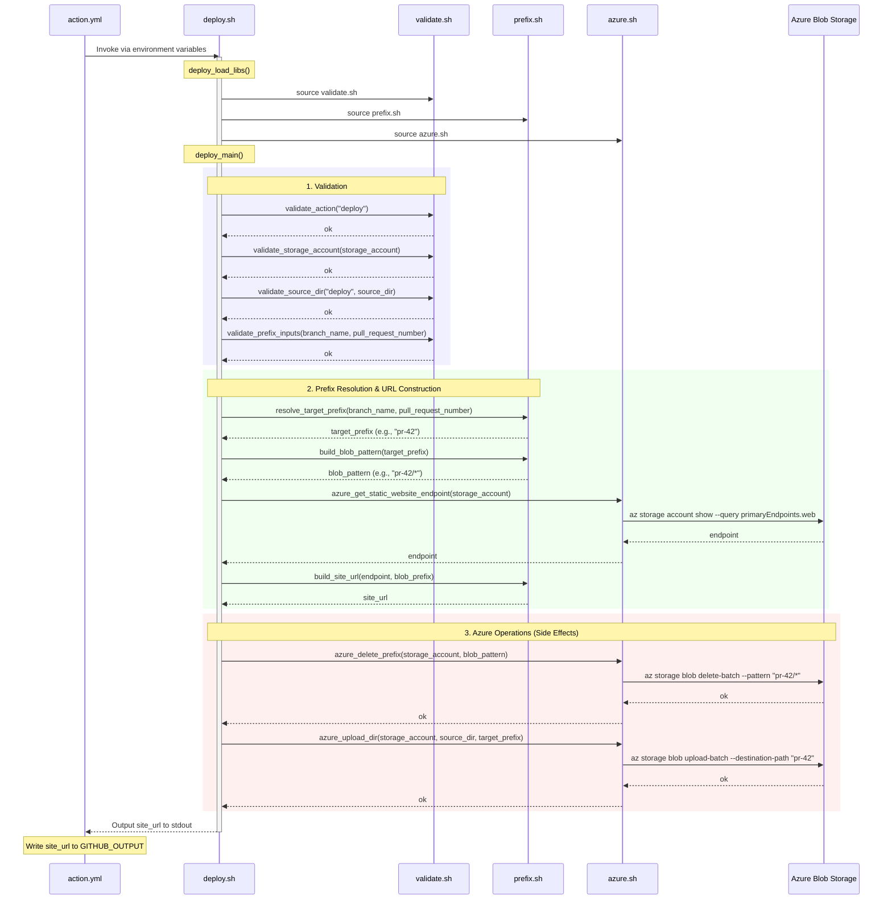

> [日本語版](deploy.ja.md)

# deploy.sh Design

## Overview

`scripts/deploy.sh` is the entrypoint script invoked from `action.yml` when `action=deploy`. It deletes all existing files under the target prefix, uploads the contents of the source directory, and outputs the deployment URL to stdout.

## Inputs

Received via environment variables or function arguments. Environment variables are mapped from `inputs` by `action.yml`.

| Priority | Function Arg | Environment Variable | Description |
|----------|-------------|---------------------|-------------|
| 1 | `$1` | `INPUT_STORAGE_ACCOUNT` | Azure Storage account name |
| 2 | `$2` | `INPUT_SOURCE_DIR` | Directory to upload |
| 3 | `$3` | `INPUT_BRANCH_NAME` | Branch name |
| 4 | `$4` | `INPUT_PULL_REQUEST_NUMBER` | PR number |
| 5 | `$5` | `INPUT_ACTION` | Action type (default: `deploy`) |
| 6 | `$6` | `INPUT_SITE_NAME` | Site identifier (derived from GITHUB_REPOSITORY if omitted) |

## Outputs

- stdout: Deployment URL (with trailing slash)
  - Example: `https://examplestorage.<zone>.web.core.windows.net/pr-42/`
- `action.yml` writes the last line of stdout to `GITHUB_OUTPUT` as `site_url`

## Processing Flow

### Sequence Diagram

### Processing Steps in Detail

#### 1. Validation (validate.sh)

All input values are validated, and invalid values cause an immediate error exit. By failing fast before Azure operations, unnecessary API calls are prevented.

| Function | Validation |
|----------|-----------|
| `validate_action` | Must be `deploy` or `cleanup` |
| `validate_storage_account` | Must be 3-24 lowercase alphanumeric characters |
| `validate_source_dir` | Must be an existing directory when `action=deploy` |
| `validate_prefix_inputs` | Either `branch_name` or `pull_request_number` must be valid |

#### 2. Prefix Resolution & URL Construction (prefix.sh)

Determines the deployment prefix from `branch_name` and `pull_request_number`, and constructs the related pattern and URL.

- `resolve_target_prefix`: Generates `pr-<number>` with priority on `pull_request_number`; falls back to `branch_name` as-is
- `build_blob_pattern`: Generates the glob pattern for deletion targets (e.g., `pr-42/*`)
- `build_site_url`: Generates the deployment URL from endpoint + prefix (guarantees trailing slash)

#### 3. Azure Operations (azure.sh)

A "clean deploy" approach that deletes existing files first, then uploads new ones.

1. **`azure_delete_prefix`**: Deletes all blobs under the target prefix using `az storage blob delete-batch`
2. **`azure_upload_dir`**: Uploads the source directory contents using `az storage blob upload-batch`

This ordering ensures that file renames and deletions are reliably reflected on the Blob side.

## Error Handling

- Each step propagates errors to the caller via `|| return 1`
- When the script is executed directly, `set -euo pipefail` causes immediate exit on undefined variable references or pipe errors
- Validation errors are detected before Azure operations, so incomplete deployments cannot occur

## Testing Approach

Flow tests (`tests/flow/test_deploy.bats`) mock the `az` command using `tests/helpers/mock_azure.sh` and verify the following:

- Execution order of delete-batch followed by upload-batch
- Arguments passed to each command (account name, pattern, source directory, prefix)
- Azure operations are not called when validation errors occur
