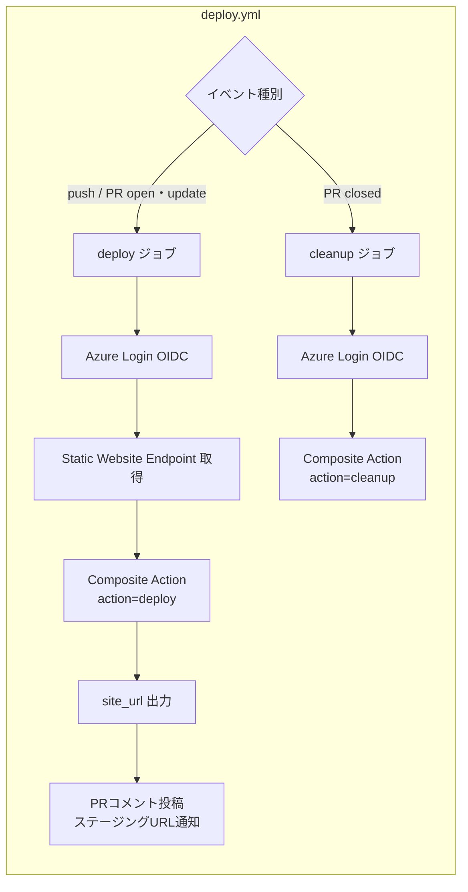
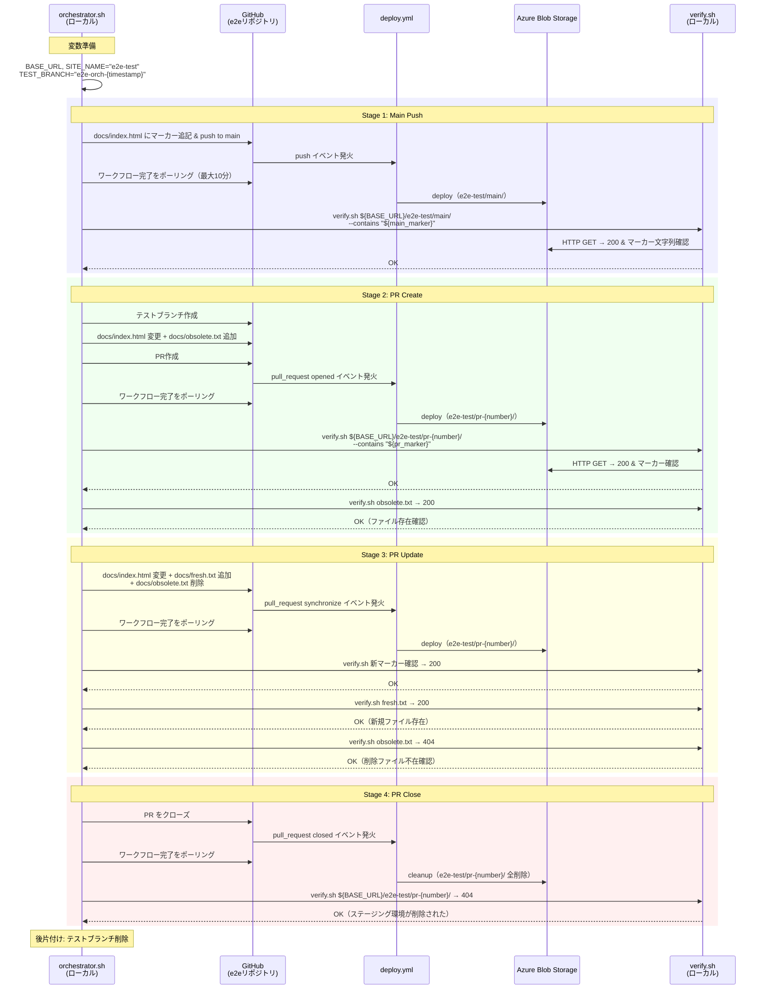
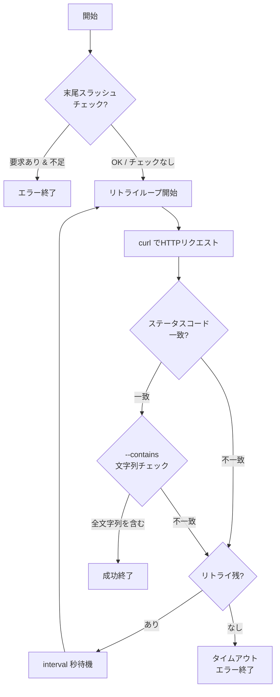

> [English](e2e.md)

# E2Eテスト設計

## 概要

E2Eテストは、Composite Action（`azure-blob-storage-site-deploy`）が実際のAzure Blob Storage環境上で正しく動作することを検証する。単体テスト・フローテストではモックで代替していたAzure操作を、実リソースに対して実行し、HTTPアクセスによるコンテンツ配信まで含めたエンドツーエンドの正当性を確認する。

### 目的

1. **ライフサイクル全体の検証**: main push → PR作成 → PR更新 → PRクローズという一連のイベントで、デプロイ・更新・削除が正しく行われることを確認する
2. **ファイル同期の検証**: delete-batch → upload-batchのクリーンデプロイ方式が、ファイルの追加・更新・削除を正確にBlob側へ反映することを確認する
3. **実利用構成での検証**: テスト用リポジトリから外部actionとして参照する構成で実行するため、公開後の利用者と同じ条件でテストできる

### テストケース

| 検証項目 | 確認内容 |
|---|---|
| mainブランチデプロイ | pushトリガーでコンテンツがアップロードされ、HTTPアクセスで取得できる |
| PRステージング作成 | PR作成時に `pr-<番号>` プレフィックスでデプロイされる |
| PRステージング更新 | PRブランチへのpush時にコンテンツが更新され、削除ファイルがBlob側から消える |
| PRステージング削除 | PRクローズ時にプレフィックス配下が全削除される（404が返る） |

---

## テスト用リポジトリを分離する理由

E2Eテストはproductリポジトリ（`azure-blob-storage-site-deploy`）とは別の専用リポジトリ（`azure-blob-storage-site-deploy-e2e`）で実行する。

1. **ワークフロー干渉の回避**: productリポジトリ内でE2Eを行うと、テスト用のPR作成・クローズがaction自体の開発ワークフローと干渉する
2. **自由なブランチ操作**: テスト用リポジトリであれば、テスト目的のブランチ操作やPR作成を制限なく行える
3. **実利用と同一構成**: 実際の利用者と同じ「外部からactionを `uses:` で参照する」構成でテストできる

---

## ローカル実行とする理由

オーケストレーターはGitHub Actionsワークフローとしてではなく、**開発マシンからローカル実行するシェルスクリプト**として実装する。

1. **`GITHUB_TOKEN` の制限回避**: GitHub Actions内で `GITHUB_TOKEN` を使ったpushやPR作成は、新しいワークフロー実行をトリガーしない（再帰防止の仕様）。ローカルからのユーザー認証による操作であれば `deploy.yml` が自然に発火する
2. **実行タイミングとの整合**: E2Eテストは実装修正後に手動で実行するものであり、CIで自動化する必要がない
3. **デバッグ容易性**: ターミナルでリアルタイムに進行状況を確認でき、失敗時の原因特定が容易

---

## リポジトリ構成

テスト関連リソースは2つのリポジトリに分かれる。

### e2eリポジトリ（`azure-blob-storage-site-deploy-e2e`）

Composite Actionの「利用者」として最低限必要なリソースのみ配置する。

```
azure-blob-storage-site-deploy-e2e/
├── .github/workflows/
│   └── deploy.yml              # Composite Actionを呼び出すワークフロー（テスト対象）
├── docs/                       # テスト用の静的サイトソース
│   ├── index.html              # メインページ
│   └── sub/
│       └── page.html           # サブディレクトリ配信確認用
└── README.md
```

### devリポジトリ（`azure-blob-storage-site-deploy-dev`）

テスト実行側のスクリプトを配置する。

```
azure-blob-storage-site-deploy-dev/
├── scripts/
│   ├── test.sh                  # テスト共通ランナー（unit / flow / e2e の入口）
│   └── e2e/
│       ├── orchestrator.sh     # E2Eシナリオ実行スクリプト（エントリーポイント）
│       ├── lib.sh              # 共有ヘルパー関数
│       └── verify.sh           # HTTP検証スクリプト（リトライ・コンテンツ検証）
├── repos/
│   ├── product/                # サブモジュール: Composite Action本体
│   └── e2e/                    # サブモジュール: E2Eテスト用リポジトリ
└── docs/
    └── e2e.ja.md               # 本書
```

---

## deploy.yml — デプロイ・クリーンアップワークフロー

Composite Actionの実利用者が記述するワークフローと同等の構成。push/PRイベントに応じてデプロイまたはクリーンアップを実行する。

### トリガー

| イベント | 条件 | 実行ジョブ |
|---|---|---|
| `push` | `main` ブランチ | deploy |
| `pull_request` opened / synchronize / reopened | PR作成・更新時 | deploy |
| `pull_request` closed | PRクローズ時 | cleanup |

### ジョブ構成



### 同時実行制御

デプロイ先プレフィックスをconcurrencyグループキーとし、同一PR内の連続pushでは先行ジョブをキャンセルする。

---

## orchestrator.sh — E2Eシナリオオーケストレーター

### 目的

ローカルから `git` / `gh` CLIを使ってpush・PR作成・PR更新・PRクローズの一連のイベントを発生させ、各ステップ後にHTTPアクセスで結果を検証する。ライフサイクル全体を1回の実行で自動検証する。

### 実行方法

```bash
# 推奨: 共通ランナー経由
./scripts/test.sh e2e

# 下位入口を直接実行する場合
./scripts/e2e/orchestrator.sh
```

`scripts/test.sh e2e` は前提条件チェックと実行サマリーを共通形式で提供し、内部で `scripts/e2e/orchestrator.sh` を呼び出す。E2Eの実行ロジック自体は引き続き `scripts/e2e/` 配下に配置する。

前提条件:
- `gh` CLIでログイン済み（`gh auth status`で確認）
- e2eリポジトリのサブモジュールが初期化済み（`git submodule update --init --recursive`）
- `jq`がインストール済み

### スクリプト構成

| ファイル | 役割 |
|---|---|
| `scripts/test.sh` | テスト共通ランナー。`e2e` サブコマンドで前提条件チェック後にオーケストレーターを呼び出す |
| `scripts/e2e/orchestrator.sh` | シナリオ実行のエントリーポイント。Stage 1〜4を順次実行し、終了時にクリーンアップ |
| `scripts/e2e/lib.sh` | 共有ヘルパー関数（`log`, `now_utc`, `gh_json`, `wait_deploy_workflow`） |
| `scripts/e2e/verify.sh` | HTTP検証スクリプト（リトライ・コンテンツ検証） |

`scripts/e2e/orchestrator.sh` は `repos/e2e/` ディレクトリ内でgit操作を行い、e2eリポジトリに対してpush / PR作成を実行する。`scripts/test.sh e2e` はその上位入口として扱う。

### シーケンス図



### シナリオステップの詳細

#### Stage 1: Main Push

mainブランチへのpushでデプロイが正しく動作することを検証する。

| 操作 | 検証内容 |
|---|---|
| `docs/index.html` にユニークマーカー文字列を追記し、mainにpush | `${BASE_URL}/e2e-test/main/` がHTTP 200を返し、マーカー文字列を含む |

マーカー文字列にはタイムスタンプを含め、過去のデプロイ結果のキャッシュではなく今回のデプロイ結果であることを保証する。

#### Stage 2: PR Create

PRの作成時にステージング環境が正しく作成されることを検証する。

| 操作 | 検証内容 |
|---|---|
| テストブランチを作成し、`docs/index.html` を変更、`docs/obsolete.txt` を追加してPRを作成 | `${BASE_URL}/e2e-test/pr-{number}/` がHTTP 200を返し、PRマーカーを含む |
| — | `obsolete.txt` がHTTP 200でアクセスできる |

#### Stage 3: PR Update

PRブランチへの追加pushで、ファイルの追加・更新・削除がすべて正しく反映されることを検証する。これはクリーンデプロイ方式（delete-batch → upload-batch）の中核的な検証項目である。

| 操作 | 検証内容 |
|---|---|
| `docs/index.html` を再変更、`docs/fresh.txt` を追加、`docs/obsolete.txt` を削除してpush | 新マーカーが反映されている（コンテンツ更新） |
| — | `fresh.txt` がHTTP 200でアクセスできる（ファイル追加） |
| — | `obsolete.txt` がHTTP 404を返す（ファイル削除の反映） |

`obsolete.txt` の404確認は、delete-batchによる全削除が正しく行われていることの証拠となる。upload-batchだけでは古いファイルが残り続けるため、この検証は不可欠である。

#### Stage 4: PR Close

PRクローズ時にステージング環境が完全に削除されることを検証する。

| 操作 | 検証内容 |
|---|---|
| PRをクローズ | `${BASE_URL}/e2e-test/pr-{number}/` がHTTP 404を返す |

### ワークフロー完了のポーリング

各ステージでGitHubイベントを発火させた後、対応する `deploy.yml` ワークフローの完了を待つ必要がある。

```
ポーリング間隔: 5秒
最大試行回数: 120回（= 最大10分）
対象API: GET /repos/{owner}/{repo}/actions/runs
フィルタ: ワークフロー名 + イベント種別 + head_sha
```

ポーリングがタイムアウトした場合はシナリオ失敗として終了する。

---

## verify.sh — HTTP検証スクリプト

### 目的

デプロイ先URLにHTTPリクエストを送信し、ステータスコードとレスポンスボディを検証する。CDNキャッシュや非同期反映による一時的な不一致をリトライで吸収する。

### インターフェース

```bash
./scripts/e2e/verify.sh <url> <expected_status> [options]
```

| 引数・オプション | 説明 | デフォルト |
|---|---|---|
| `<url>` | 検証対象のURL | （必須） |
| `<expected_status>` | 期待するHTTPステータスコード | （必須） |
| `--contains <text>` | レスポンスボディに含まれるべき文字列（複数指定可） | — |
| `--require-trailing-slash` | URLパスの末尾スラッシュを強制 | — |
| `--retries <count>` | リトライ回数 | 10 |
| `--interval <seconds>` | リトライ間隔（秒） | 3 |
| `--timeout <seconds>` | curlタイムアウト（秒） | 10 |

### 処理フロー



### 設計上のポイント

- **リトライ機構**: Azure Blob Storageの静的Webサイト機能は、Blobアップロード後のHTTP反映に若干のラグがある場合がある。リトライにより一時的な不整合を吸収する
- **複数 `--contains` 対応**: 1回のリクエストで複数の文字列を検証でき、マーカー文字列とページタイトルの同時確認等が可能
- **末尾スラッシュ検証**: Azure Blob Storageは `/pr-42` → `/pr-42/` の自動リダイレクトを行わないため、URLの正当性をスクリプトレベルで保証する

---

## テスト用静的サイト

e2eリポジトリの `docs/` ディレクトリに最小限のHTMLファイルを配置する。

```
docs/
├── index.html          # メインページ（マーカー挿入対象）
└── sub/
    └── page.html       # サブディレクトリ配信確認用
```

- `index.html`: E2Eオーケストレーターがマーカー文字列を動的に挿入し、デプロイごとにコンテンツの新鮮さを確認する
- `sub/page.html`: サブディレクトリ構造がBlob Storage上で正しく配信されることの確認用

テスト中に一時的に追加・削除されるファイル:
- `docs/obsolete.txt`: Stage 2で追加、Stage 3で削除。クリーンデプロイによるファイル削除反映を検証
- `docs/fresh.txt`: Stage 3で追加。ファイル追加の反映を検証

---

## エラーハンドリングと後片付け

オーケストレーターは `trap` を使い、正常終了・異常終了を問わず後片付けを実行する。

1. **trapによるクリーンアップ保証**: `trap cleanup EXIT` でスクリプト終了時に必ずクリーンアップ関数を実行する。`set -e` による途中終了でもリソースが残留しない
2. **冪等なクリーンアップ**: PRが未作成・既にクローズされている場合やブランチが存在しない場合でもエラーにならない
3. **部分失敗の許容**: クリーンアップ内の個別操作は `|| cleanup_failed=1` でキャッチし、1つの失敗が他の操作を妨げない
4. **終了コードの分離**: シナリオ失敗とクリーンアップ失敗を区別し、両方失敗した場合はシナリオ失敗の終了コードを優先する
