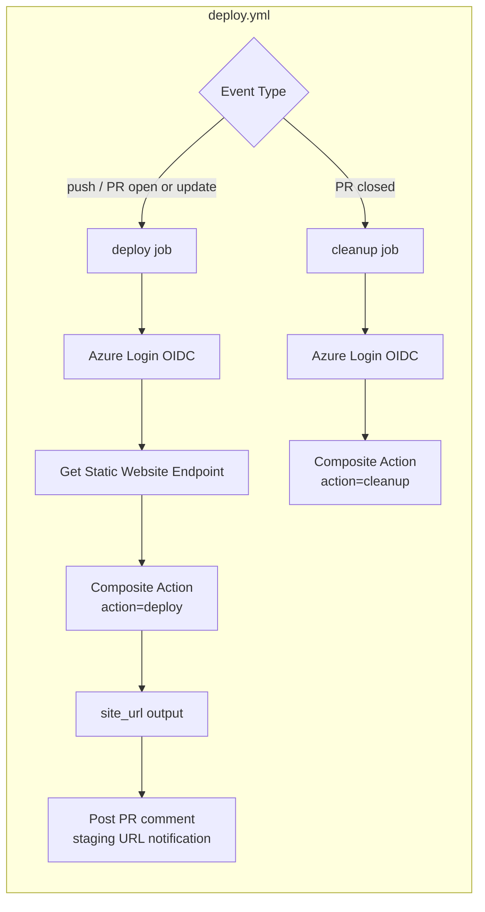
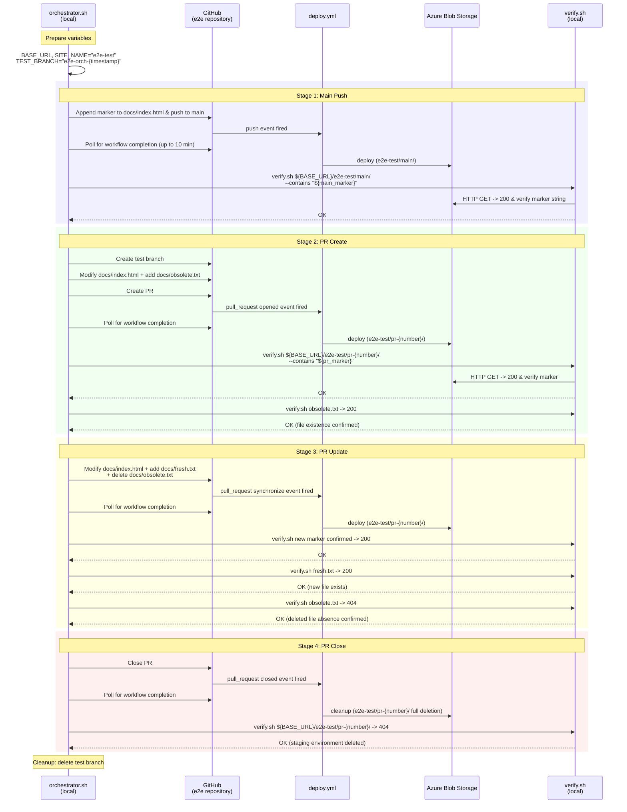
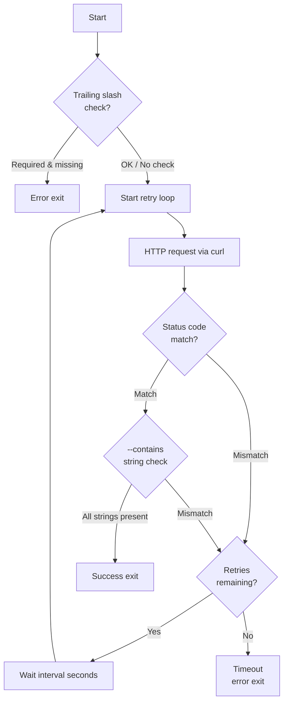

> [日本語版](e2e.ja.md)

# E2E Test Design

## Overview

E2E tests verify that the Composite Action (`azure-blob-storage-site-deploy`) works correctly on an actual Azure Blob Storage environment. Unlike unit tests and flow tests that substitute Azure operations with mocks, E2E tests execute against real resources and confirm end-to-end correctness including content delivery via HTTP access.

### Goals

1. **Full lifecycle verification**: Confirm that deploy, update, and cleanup work correctly across the sequence of events: main push, PR creation, PR update, and PR close
2. **File synchronization verification**: Confirm that the clean deploy approach (delete-batch followed by upload-batch) accurately reflects file additions, updates, and deletions on the Blob side
3. **Real-world configuration verification**: Tests run from a separate test repository referencing the action externally, matching the same conditions as actual end users after publication

### Test Cases

| Test Item | Verification |
|---|---|
| Main branch deploy | Content is uploaded via push trigger and retrievable via HTTP access |
| PR staging creation | Deployed with `pr-<number>` prefix when a PR is created |
| PR staging update | Content is updated on push to PR branch, and deleted files are removed from Blob side |
| PR staging deletion | All files under the prefix are deleted on PR close (returns 404) |

---

## Why Use a Separate Test Repository

E2E tests run in a dedicated repository (`azure-blob-storage-site-deploy-e2e`), separate from the product repository (`azure-blob-storage-site-deploy`).

1. **Avoiding workflow interference**: Running E2E within the product repository would cause test PR creation and closing to interfere with the action's own development workflows
2. **Unrestricted branch operations**: A dedicated test repository allows unrestricted branch operations and PR creation for testing purposes
3. **Identical configuration to real usage**: Tests use the same "referencing the action externally via `uses:`" configuration as actual users

---

## Why Run Locally

The orchestrator is implemented as a **shell script run locally from the development machine**, rather than as a GitHub Actions workflow.

1. **Bypassing `GITHUB_TOKEN` limitations**: Pushes and PR creations using `GITHUB_TOKEN` within GitHub Actions do not trigger new workflow runs (a recursion prevention mechanism). User-authenticated operations from local naturally trigger `deploy.yml`
2. **Alignment with execution timing**: E2E tests are run manually after implementation changes and do not need CI automation
3. **Ease of debugging**: Progress can be monitored in real time from the terminal, making it easy to identify the cause of failures

---

## Repository Structure

Test-related resources are split across two repositories.

### E2E Repository (`azure-blob-storage-site-deploy-e2e`)

Contains only the minimum resources needed as a "consumer" of the Composite Action.

```
azure-blob-storage-site-deploy-e2e/
├── .github/workflows/
│   └── deploy.yml              # Workflow that invokes the Composite Action (test target)
├── docs/                       # Static site source for testing
│   ├── index.html              # Main page
│   └── sub/
│       └── page.html           # For verifying subdirectory delivery
└── README.md
```

### Dev Repository (`azure-blob-storage-site-deploy-dev`)

Contains the test execution scripts.

```
azure-blob-storage-site-deploy-dev/
├── scripts/
│   ├── test.sh                  # Common test runner (entry point for unit / flow / e2e)
│   └── e2e/
│       ├── orchestrator.sh     # E2E scenario execution script (entry point)
│       ├── lib.sh              # Shared helper functions
│       └── verify.sh           # HTTP verification script (retry and content verification)
├── repos/
│   ├── product/                # Submodule: Composite Action itself
│   └── e2e/                    # Submodule: E2E test repository
└── docs/
    └── e2e.md                  # This document
```

---

## deploy.yml — Deploy and Cleanup Workflow

A workflow configuration equivalent to what real users of the Composite Action would write. Executes deploy or cleanup in response to push/PR events.

### Triggers

| Event | Condition | Job Executed |
|---|---|---|
| `push` | `main` branch | deploy |
| `pull_request` opened / synchronize / reopened | PR creation or update | deploy |
| `pull_request` closed | PR close | cleanup |

### Job Structure



### Concurrency Control

The deploy destination prefix is used as the concurrency group key, so consecutive pushes within the same PR cancel the preceding job.

---

## orchestrator.sh — E2E Scenario Orchestrator

### Purpose

Uses `git` / `gh` CLI from local to generate a sequence of events (push, PR creation, PR update, PR close), verifying results via HTTP access after each step. Automatically verifies the entire lifecycle in a single run.

### How to Run

```bash
# Recommended: via the common runner
./scripts/test.sh e2e

# Running the sub-entry point directly
./scripts/e2e/orchestrator.sh
```

`scripts/test.sh e2e` provides prerequisite checks and an execution summary in a common format, internally calling `scripts/e2e/orchestrator.sh`. The E2E execution logic itself remains under `scripts/e2e/`.

Prerequisites:
- Logged in with `gh` CLI (verify with `gh auth status`)
- E2E repository submodule initialized (`git submodule update --init --recursive`)
- `jq` installed

### Script Structure

| File | Role |
|---|---|
| `scripts/test.sh` | Common test runner. Checks prerequisites with the `e2e` subcommand, then invokes the orchestrator |
| `scripts/e2e/orchestrator.sh` | Entry point for scenario execution. Runs Stages 1-4 sequentially and cleans up on exit |
| `scripts/e2e/lib.sh` | Shared helper functions (`log`, `now_utc`, `gh_json`, `wait_deploy_workflow`) |
| `scripts/e2e/verify.sh` | HTTP verification script (retry and content verification) |

`scripts/e2e/orchestrator.sh` performs git operations within the `repos/e2e/` directory, executing pushes and PR creation against the E2E repository. `scripts/test.sh e2e` serves as the higher-level entry point.

### Sequence Diagram



### Scenario Step Details

#### Stage 1: Main Push

Verifies that deploy works correctly on push to the main branch.

| Operation | Verification |
|---|---|
| Append a unique marker string to `docs/index.html` and push to main | `${BASE_URL}/e2e-test/main/` returns HTTP 200 and contains the marker string |

The marker string includes a timestamp to guarantee it reflects the current deploy result rather than a cached result from a previous deploy.

#### Stage 2: PR Create

Verifies that a staging environment is correctly created when a PR is opened.

| Operation | Verification |
|---|---|
| Create a test branch, modify `docs/index.html`, add `docs/obsolete.txt`, and create a PR | `${BASE_URL}/e2e-test/pr-{number}/` returns HTTP 200 and contains the PR marker |
| — | `obsolete.txt` is accessible with HTTP 200 |

#### Stage 3: PR Update

Verifies that file additions, updates, and deletions are all correctly reflected on additional pushes to the PR branch. This is the core verification of the clean deploy approach (delete-batch followed by upload-batch).

| Operation | Verification |
|---|---|
| Re-modify `docs/index.html`, add `docs/fresh.txt`, delete `docs/obsolete.txt`, and push | New marker is reflected (content update) |
| — | `fresh.txt` is accessible with HTTP 200 (file addition) |
| — | `obsolete.txt` returns HTTP 404 (file deletion reflected) |

The 404 confirmation for `obsolete.txt` serves as evidence that the delete-batch full deletion is working correctly. Without it, upload-batch alone would leave old files behind, making this verification essential.

#### Stage 4: PR Close

Verifies that the staging environment is completely deleted when a PR is closed.

| Operation | Verification |
|---|---|
| Close the PR | `${BASE_URL}/e2e-test/pr-{number}/` returns HTTP 404 |

### Workflow Completion Polling

After firing a GitHub event in each stage, the corresponding `deploy.yml` workflow completion must be awaited.

```
Polling interval: 5 seconds
Maximum attempts: 120 (= up to 10 minutes)
Target API: GET /repos/{owner}/{repo}/actions/runs
Filter: workflow name + event type + head_sha
```

If polling times out, the scenario exits as failed.

---

## verify.sh — HTTP Verification Script

### Purpose

Sends HTTP requests to deploy target URLs and verifies status codes and response bodies. Absorbs temporary inconsistencies caused by CDN caching or asynchronous propagation through retries.

### Interface

```bash
./scripts/e2e/verify.sh <url> <expected_status> [options]
```

| Argument / Option | Description | Default |
|---|---|---|
| `<url>` | URL to verify | (required) |
| `<expected_status>` | Expected HTTP status code | (required) |
| `--contains <text>` | String(s) that must be present in the response body (multiple allowed) | — |
| `--require-trailing-slash` | Enforce trailing slash on the URL path | — |
| `--retries <count>` | Number of retries | 10 |
| `--interval <seconds>` | Retry interval (seconds) | 3 |
| `--timeout <seconds>` | curl timeout (seconds) | 10 |

### Processing Flow



### Design Considerations

- **Retry mechanism**: Azure Blob Storage's static website feature may have a slight lag in HTTP availability after blob upload. Retries absorb these temporary inconsistencies
- **Multiple `--contains` support**: Multiple strings can be verified in a single request, enabling simultaneous checks for marker strings and page titles
- **Trailing slash verification**: Azure Blob Storage does not automatically redirect `/pr-42` to `/pr-42/`, so URL correctness is enforced at the script level

---

## Test Static Site

Minimal HTML files are placed in the `docs/` directory of the E2E repository.

```
docs/
├── index.html          # Main page (marker insertion target)
└── sub/
    └── page.html       # For verifying subdirectory delivery
```

- `index.html`: The E2E orchestrator dynamically inserts marker strings to verify content freshness on each deploy
- `sub/page.html`: Verifies that subdirectory structures are correctly served on Blob Storage

Files temporarily added and removed during testing:
- `docs/obsolete.txt`: Added in Stage 2, removed in Stage 3. Verifies that clean deploy reflects file deletions
- `docs/fresh.txt`: Added in Stage 3. Verifies that file additions are reflected

---

## Error Handling and Cleanup

The orchestrator uses `trap` to execute cleanup regardless of whether the script exits normally or abnormally.

1. **Guaranteed cleanup via trap**: `trap cleanup EXIT` ensures the cleanup function runs on script exit. Resources are not left behind even on early termination via `set -e`
2. **Idempotent cleanup**: No errors occur even if the PR has not been created, is already closed, or the branch does not exist
3. **Tolerance for partial failures**: Individual operations within cleanup are caught with `|| cleanup_failed=1`, so one failure does not prevent other operations
4. **Separate exit codes**: Scenario failures and cleanup failures are distinguished; when both fail, the scenario failure exit code takes priority
